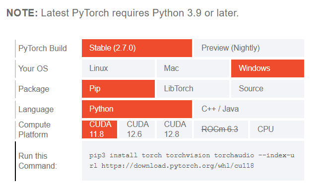

# Environment Initiation and Setup
## Table of Contents
- [Setup with Terminal](#setup-with-terminal)
    - [CUDA](#cuda)
    - [Installing with `pip`](#installing-with-pip)
    - [Checking PyTorch's version and job](#checking-pytorchs-version-and-job)

This lecture note introduces the environment initiation ans setup before working with

PyTorch (`torch`) can be installed and used on Windows platforms. Window 7 or greater are required, but Window 10 or greater are recommended.

## Setup with Terminal

### CUDA
According to [NVIDIA Developer](https://developer.nvidia.com/cuda-zone#:~:text=CUDA%C2%AE%20is%20a%20parallel,harnessing%20the%20power%20of%20GPUs.), CUDA® is a parallel computing platform and programming model developed by NVIDIA for general computing on graphical processing units (GPUs). With CUDA, developers are able to dramatically speed up computing applications by harnessing the power of GPUs. In brief, CUDAs are commonly used for computing.

In AI and AI-related fields, CUDA is pivotal for its capabilities in accelerating a huge number of computations, such as working with PyTorch.

### Installing with `pip`

For the most appropriate version, please access [PyTorch | Get Started](https://pytorch.org/get-started/locally/#windows-installation), then scroll down until you see the table as below.


As aforementioned, CUDA helps PyTorch performs better as it provides parallel computing platform, accelerating speed in training model and other tasks.

In my GitHub repository, I chose my appropriate PyTorch's version, and I put it in `requirement.txt` file, alongwith other necessary libraries.
In my case, I choose `CUDA 12.6`, so the `pip3` statement is:
```bash
pip3 install torch torchvision torchaudio --index-url https://download.pytorch.org/whl/cu118
```

### Checking PyTorch's version and job
After download PyTorch, you can check the version of `torch` if it is appropriate by using the following code snippet:

```python
import torch
print("PyTorch version")
print(torch.__version__)
```
In my case, it returns:
```
PyTorch version
2.7.0+cpu
```

Now let's check if the `torch` works well by the following code snippet.
```python
import torch
x = torch.rand(5, 3)
print(x)
```
Now, it should returns something that is similar to:
```
tensor([[0.1002, 0.0356, 0.3396],
        [0.8364, 0.1004, 0.9889],
        [0.6799, 0.6377, 0.5759],
        [0.6417, 0.3957, 0.1448],
        [0.3405, 0.4941, 0.4843]])
```
### Check of CUDA version and its availability
```python
print("Check of CUDA version and its availability")
print(torch.version.cuda)
print(torch.cuda.is_available(), end = '\n\n')
```