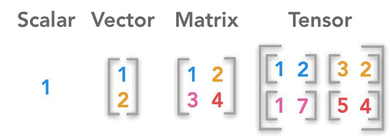

# Lesson 03 | Tensor and Operation

>This lecture note introduces the fundamental unit of Deep Learning algorithms and how they interact with others through operations.
## Table of Contents
[1. Tensor](#1-tensor) \
&emsp;&emsp;[1.1. What is Tensor?](#11-what-is-tensor) \
&emsp;&emsp;[1.2. Tensor in PyTorch (Python)](#12-tensor-in-pytorch-pythons-library) \
[2. Operation](#2-operation) \
&emsp;&emsp;[2.1. Mathematical Operation](#21-mathematical-operation) \
&emsp;&emsp;[2.2. Agregate Function](#22-aggregate-function) \
&emsp;&emsp;[2.3. Shape adjustment](#23-shape-adjustment) 


## 1. Tensor
### 1.1. What is Tensor?

> In mathematics, a tensor is an algebraic object that describes a multilinear relationship between sets of algebraic objects related to a vector space. Tensors may map between different objects such as vectors, scalars, and even other tensors. [1]

There are many types of tensors, including scalars and vectors (which are the simplest tensors), dual vectors, multilinear maps between vector spaces, and even some operations such as the dot product.



In brief, it can be simply understood that tensor is a generalization of scalars (0D), vectors (1D), matrices (2D), and higher-dimensional arrays (3D+).

### 1.2. Tensor in PyTorch
#### Tensor initialization
With the assistance of PyTorch, users can easily generate a tensor with the following syntax:
+ From `lists`/`arrays`: torch.tensor([...]), np.array([...])
+ Random: `torch.rand()`, `torch.randn()`, `torch.zeros()`, `torch.ones()`
+ Identity or custom initialization

For example:
```python
import torch

device = torch.device("cuda" if torch.cuda.is_available() else "cpu")
print(f"Using device: {device}")

tensor_0D = torch.tensor(0)        # Create a 0D tensor
tensor_1D = torch.tensor([1])      # Create a 1D tensor
tensor_2D = torch.tensor([2, 3])   # Create a 2D tensor
tensor_2_2 = torch.tensor(         # Create a 2x2 tensor
    [[1, 0], [0, 1]]
) 
```
#### Tensor datatype
- `float32`, `float64` – for most model weights and inputs
- `int32`, `int64` – for labels, counters, indices
- `bool` – for masks, conditions

## 2. Operation
> In the context of tensors, an "operation" refers to any mathematical function or transformation that is applied to one or more tensors to produce new tensors. Think of it as how you manipulate numbers in basic arithmetic (addition, multiplication) but extended to these multi-dimensional data structures.

### 2.1. Mathematical operation
They encompass:
- **Numerical operations**
    + Addition `+`
    + subtraction `-`
    + Multiplication `*` or `torch.mul()`
    + Division `/`
- **Comparison Operations**
    + Equality (`==` or `torch.eq()`)
    + Greater than (`>` or `torch.gt()`)
    + Less than (`<` or `torch.lt()`)
- **Mathematical functions** (exponential `torch.exp()`, logarithm `torch.log()`, sin `sin()`, absolute value `torch.abs()`, ...)
- **Matrix Operation**
    + Transpose `.T` or `torch.transpose()`
    + Matrix Multiplication `@` or `torch.mamul()`
    + Dot product `torch.dot()`

### 2.2. Aggregate function
They include **sum** `torch.sum()`, **max** `torch.max()` / **min** `torch.min()`, **mean** `torch.mean()`, ...

For example:
```python
import torch

# Create a 2D tensor (a matrix)
data = torch.tensor([[1., 2.],
                     [3., 4.]])

# Calculate aggregate values
Sum = torch.sum(data)
Max = torch.max(data)
Min = torch.min(data)
Mean = torch.mean(data)

# Print results
print(f'Sum: {Sum}')
print(f'Min: {Min}')
print(f'Max: {Max}')
print(f'Mean: {Mean}')
```
Now it should Return:
```text
Sum: 10.0
Min: 1.0
Max: 4.0
Mean: 2.5
```

### 2.3. Shape adjustment
- **Reshaping Operations**: `torch.reshape()` or `torch.view()`
- **Concatentation**: `torch.cat((a, b), dim = 0)` for concatinate along rows, or `torch.cat((a, b), dim = 1)` for concatinate along columns.
- **Stacking**: `torch.stack()`

Here is an example:
```python
import torch

# --- 1. Device Setup ---
device = torch.device("cuda" if torch.cuda.is_available() else "cpu")
print(f"--- Device Setup ---")
print(f"Using device: {device}\n")

print('')
print('RESHAPE TENSOR ==================================')
original_tensor = torch.arange(12, dtype=torch.float32, device=device)
print(f"--- Original Tensor ---")
print(f"Tensor: {original_tensor}")

reshaped_tensor = original_tensor.reshape(3, 4)
print(f"--- Reshaping with .reshape(3, 4) ---")
print(f"Reshaped Tensor:\n{reshaped_tensor}")

print('')
print('TENSOR CONCATENATION ============================')
tensor_a = torch.tensor([[10, 20, 30],
                         [40, 50, 60]], dtype=torch.float32, device=device)
tensor_b = torch.tensor([[70, 80, 90],
                         [100, 110, 120]], dtype=torch.float32, device=device)

print(f"--- Concatenation (torch.cat()) ---")
print(f"Tensor A:\n{tensor_a}")
print(f"Tensor B:\n{tensor_b}")

concat_rows = torch.cat((tensor_a, tensor_b), dim=0)
print(f"Concatenated along dim=0 (rows):\n{concat_rows}")

concat_cols = torch.cat((tensor_a, tensor_b), dim=1)
print(f"Concatenated along dim=1 (columns):\n{concat_cols}")


# --- 5. Stacking Operation: torch.stack() ---
print('')
print('TENSOR STACKING =================================')
stack_tensor1 = torch.tensor([1, 2, 3], dtype=torch.float32, device=device)
stack_tensor2 = torch.tensor([4, 5, 6], dtype=torch.float32, device=device)
stack_tensor3 = torch.tensor([7, 8, 9], dtype=torch.float32, device=device)

print(f"--- Stacking (torch.stack()) ---")
print(f"Tensors to stack: {stack_tensor1}, {stack_tensor2}, {stack_tensor3}")

stacked_dim0 = torch.stack((stack_tensor1, stack_tensor2, stack_tensor3), dim=0)
print(f"Stacked along dim=0 (new 1st dim):\n{stacked_dim0}")

stacked_dim1 = torch.stack((stack_tensor1, stack_tensor2, stack_tensor3), dim=1)
print(f"Stacked along dim=1 (new 2nd dim):\n{stacked_dim1}")
```
Now it should return:
```
--- Device Setup ---
Using device: cuda


RESHAPE TENSOR ==================================
--- Original Tensor ---
Tensor: tensor([ 0.,  1.,  2.,  3.,  4.,  5.,  6.,  7.,  8.,  9., 10., 11.],
       device='cuda:0')
--- Reshaping with .reshape(3, 4) ---
Reshaped Tensor:
tensor([[ 0.,  1.,  2.,  3.],
        [ 4.,  5.,  6.,  7.],
        [ 8.,  9., 10., 11.]], device='cuda:0')

TENSOR CONCATENATION ============================
--- Concatenation (torch.cat()) ---
Tensor A:
tensor([[10., 20., 30.],
        [40., 50., 60.]], device='cuda:0')
Tensor B:
tensor([[ 70.,  80.,  90.],
        [100., 110., 120.]], device='cuda:0')
Concatenated along dim=0 (rows):
tensor([[ 10.,  20.,  30.],
        [ 40.,  50.,  60.],
        [ 70.,  80.,  90.],
        [100., 110., 120.]], device='cuda:0')
Concatenated along dim=1 (columns):
tensor([[ 10.,  20.,  30.,  70.,  80.,  90.],
        [ 40.,  50.,  60., 100., 110., 120.]], device='cuda:0')

TENSOR STACKING =================================
--- Stacking (torch.stack()) ---
Tensors to stack: tensor([1., 2., 3.], device='cuda:0'), tensor([4., 5., 6.], device='cuda:0'), tensor([7., 8., 9.], device='cuda:0')
Stacked along dim=0 (new 1st dim):
tensor([[1., 2., 3.],
        [4., 5., 6.],
        [7., 8., 9.]], device='cuda:0')
Stacked along dim=1 (new 2nd dim):
tensor([[1., 4., 7.],
        [2., 5., 8.],
        [3., 6., 9.]], device='cuda:0')
```

> *What are the differences between **concatenation** and **stack**?*
- `torch.cat()` (concatenate) joins tensors along an existing dimension, increasing the size of that dimension. Input tensors must match in all other dimensions.
- `torch.stack()` joins tensors by creating a new dimension. Input tensors must have the exact same shape.
## REFERENCES
[1] Wikipedia contributors. (2025, April 20). Tensor. Wikipedia. https://en.wikipedia.org/wiki/Tensor \
[2] Học viện spacedev. (n.d.). https://spacedev.vn/resources/docs/pytorch/tensor-operations