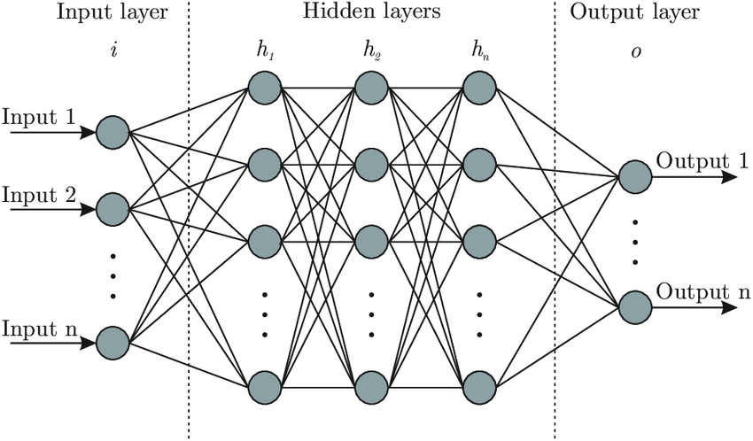

# Lesson 04 | Basic Neural Network with PyTorch

> This lecture provides a **foundational understanding** of building and training neural networks using PyTorch. We'll cover essential components like `nn.Module`, linear layers, activation and loss functions, and delve into the critical processes of optimization and backpropagation, with a brief introduction to creating custom layers.


# Table of Contents
[1. Introduction to Neural Networks with Pytorch](#1-introduction-to-neural-networks-with-pytorch) \
&emsp;&emsp;[1.1. What is Neural Network?](#11-what-is-neural-network) \
&emsp;&emsp;[1.2. How Neural Network works?](#12-how-neural-network-works) \
&emsp;&emsp;[1.3. Why Neural Network?](#13-why-neural-network) \
&emsp;&emsp;[1.4. Uses of Neural Network in Natural Language Processing (NLP)](#14-uses-of-neural-network-in-natural-language-processing-nlp) \
[2. Building blocks of Neural Networks with PyTorch](#2-building-blocks-of-neural-networks-with-pytorch) \
&emsp;&emsp;[2.1. `nn.Module`](#21-nnmodule) \
&emsp;&emsp;[2.2. Fully connected linear transformation layer](#22-fully-connected-linear-transformation-layer) \
&emsp;&emsp;&emsp;&emsp;[2.2.1 Mathematical foundation](#221-mathematical-foundation) \
&emsp;&emsp;&emsp;&emsp;[2.2.2. PyTorch approach](#222-pytorch-approach)\
&emsp;&emsp;&emsp;&emsp;[2.2.3. Attribute of Fully Connected Linear Transformation](#223-attribute-of-fully-connected-linear-transformation)\
&emsp;&emsp;&emsp;&emsp;[2.2.4. Use of Fully Connected Linear Transformation](#224-use-of-fully-connected-linear-transformation) \
&emsp;&emsp;[2.3. Activation function](#224-use-of-fully-connected-linear-transformation) \
&emsp;&emsp;&emsp;&emsp;[2.3.1. Impact of activation function](#231-impact-of-activation-function) \
&emsp;&emsp;&emsp;&emsp;[2.3.2. Why is non-linearity important in Neural Networks?](#232-why-is-non-linearity-important-in-neural-networks) \
&emsp;&emsp;&emsp;&emsp;[2.3.3. Types of Activation function](#233-types-of-activation-function) \
&emsp;&emsp;[2.4. Loss function](#24-loss-function)


[REFERENCES](#references) 


## 1. Introduction to Neural Networks with Pytorch
### 1.1. What is Neural Network?
> *Neural networks are a type of machine learning algorithm inspired by the structure and function of the human brain. They consist of interconnected nodes or neurons that process data, much like how neurons in the brain communicate. These networks can learn to recognize patterns and make predictions based on the data they are trained on.*



**Neurons (Nodes)**: These are the fundamental processing units. Each neuron receives inputs, performs a simple computation, and then passes an output to other neurons.

**Layers**: Neurons are typically arranged in layers:
- Input Layer: This is where the raw data (e.g., pixel values of an image, words in a sentence) enters the network.
- Hidden Layers: These are the "thinking" layers in between the input and output. They perform complex transformations and learn abstract features from the data. Deep neural networks have many hidden layers.
- Output Layer: This layer produces the final result of the network, such as a classification (e.g., "cat" or "dog") or a prediction (e.g., a stock price).

### 1.2. How Neural Network works?

Learning in neural network, actually is the process of establishment and adjustment of weights of the connections between nodes in a neural system. Those processes are commonly called as ***training***. These weights will be optimised while training occurs. Particularly, this process is to refine its weights to minimize errors between its predictions and the actual values.

An ***activation function*** adds non-linearity to a neural network layer’s output, enabling the model to learn complex patterns. Without it, the network would act like a simple linear model. Common activation functions include `ReLU` (Rectified Linear Unit), which outputs zero for negative inputs and the input itself if positive, `sigmoid`, which squashes values between 0 and 1, and `tanh`, which outputs values between -1 and 1. Activation functions enable neural networks to approximate complex functions and solve a wide variety of tasks such as classification, regression, and more.

A technique called ***backpropagation*** *(will be introduced later in this lecture)* facilitates this weight adjustment. Backpropagation calculates the error in the output and propagates it back through the network, iteratively adjusting weights until a desired accuracy level is achieved. Once trained, the network can make predictions on new data, such as identifying cats in images.

### 1.3. Why Neural Network?
Neural networks are becoming an essential tool for many businesses and organizations. Here are some reasons why they are so important:

- **Automation**: Automating tasks that were previously done by humans, such as customer service, data analysis, and image processing can be assisted by neural networks. This can save businesses time and money.
- **Improved Decision-Making**: Businesses can make better decisions by providing insights that would be difficult or impossible to obtain using traditional methods.
- **Increased Efficiency**: Business processes can be improved by automating tasks, reducing errors, and improving decision-making.
- **New Products and Services**: Businesses are enabled to create new products and services that would not be possible without AI.

### 1.4. Uses of Neural Network in Natural Language Processing (NLP)

Neural networks have given NLP models a huge capacity for understanding and simulating human language. They have allowed machines to predict words and address topics that were not part of the learning process. To achieve this performance in NLP processes, the neural networks must be trained with large amounts of documents (corpora) according to the type of text or language to be processed.

In NLP language models, neural networks act in the early stages, transforming vocabulary words into vectors. They act based on the principle that, in a text, the meaning of a certain word is associated with the words found around it. These vectors are used in simple operations to provide reasonable results at the semantic level. 

Neural networks are also employed in natural language technology to enable computers to successfully perform the NLP process. In this way, texts or documents can be processed, information extracted and the meaning of the data determined. 
- For example, chatbots or sentiment analysis for social media comments.


## 2. Building Blocks of Neural Networks with PyTorch
To manage and function neural networks, Pytorch provides `torch.nn` as a sub-module to perform these tasks. In these lectures, if something likes `nn.<some_thing>`, it is similar to `torch.nn.<something>`. The following sub-modules will be also imported as:
```py
import torch.nn as nn
```
### 2.1. `nn.Module`
`nn.Module` is the fundamental base class for all neural network modules in PyTorch. `nn.Module` is the base class for all neural network modules in PyTorch. Any neural network component, from a single layer to a complete deep learning model, should inherit from `nn.Module`.

Here is an example of defining a Neural Network Model
```py
import torch
import torch.nn as nn
import torch.nn.functional as F
class MySimpleModel(nn.Module):
    def __init__(self):
        super().__init__()  # Call nn.Module's constructor to properly initialize the module
        # Define layers
        self.lin1 = nn.Linear(4, 2)
        self.lin2 = nn.Linear(2, 1)
    def forward(self, x):
        # Connect nodes of the layers
        x = self.lin1(x)
        x = self.lin2(x)
        return x
```
The code snippet above illustrates the following neural network architecture.


More sophisticated models will be introduced and analysed in detail in the following lessons.

### 2.2. Fully connected linear transformation layer
#### 2.2.1. Mathematical foundation
>*`nn.Linear` in the context of deep learning typically refers to a linear transformation or fully connected layer in a neural network. It's a fundamental building block in many neural network architectures.* 

It applies an affine linear transformation to the incoming data: 
$$
y=xA^T+b
$$
where:
- $x$ is the input tensor.
- $A$ is the weight matrix (often denoted as ***weight*** in implementations).
- $b$ is the bias vector (often denoted as bias).
- $y$ is the output tensor.

For example, let

- $x$ has a size of $1 \times 4$
- $A$ has a size of $2 \times 4$
- $b$ has a size of $1 \times 2$

then the transformed vector $y = xA^T+b$ has a size of $1 \times 2$.

#### 2.2.2. PyTorch approach
In PyTorch, `nn.Linear(in_features, out_features)` represents a fully connected linear transformation (also called a dense layer). Mathematically, it implements the function:

Its parameters consist of:
- `in_features` (`int`) – size of each input sample
- `out_features` (`int`) – size of each output sample
- `bias` (`bool`) – If set to `False`, the layer will not learn an additive bias. Default: `True`

Here is an example:
```py
import torch
import torch.nn as nn

# Define a linear layer
# It expects an input with 10 features and will output 5 features
linear_layer = nn.Linear(in_features=10, out_features=5)

# Create a dummy input tensor (batch size of 3, 10 features)
# Imagine 3 samples, each with 10 numerical attributes
input_tensor = torch.randn(3, 10)
print("Input tensor shape:", input_tensor.shape)

# Pass the input through the linear layer
output_tensor = linear_layer(input_tensor)
print("Output tensor shape:", output_tensor.shape)

# Accessing the learned parameters
print("\nWeight matrix shape:", linear_layer.weight.shape)
print("Bias vector shape:", linear_layer.bias.shape)
```
It should return the following result.
```
Input tensor shape: torch.Size([3, 10])
Output tensor shape: torch.Size([3, 5])

Weight matrix shape: torch.Size([5, 10])
Bias vector shape: torch.Size([5])
```

#### 2.2.3. Attribute of Fully Connected Linear Transformation
##### a. Weight Matrix $A$
- Shape: `out_features` $\times$ `in_features`
- Contains learnable parameters that determine how input features are linearly combined.
- Each row of $W$ corresponds to the weights used to compute one output feature.

##### b. Bias Vector $b$
- Shape: `out_features`
- Each output feature has an associated bias added after the weighted sum.
- Also learnable during training.

##### c. Linear Mapping
- Mathematically: $y = xA^T+b$
- The operation maps input vectors from $\mathbb{R}^n \rightarrow \mathbb{R}^m$ using affine transformation (linear + bias).
- By itself, it is purely linear. In other words, without an activation function (e.g., `ReLU`, `Sigmoid`), stacking multiple linear layers is equivalent to just one.

##### d. Fully Connected
Each output depends on all input features. That’s why it's called fully connected: 
> Every node in one layer connects to every node in the next.

##### e. Support batches

If the input tensor $x$ has shape `[batch_size,in_features]`, it means you're processing a batch of inputs, where each input has `in_features` dimensions. 
When passed through a fully connected linear layer (e.g., `nn.Linear(in_features, out_features)`), the layer applies the same linear transformation to each input in the batch. As a result, the output tensor will have shape `[batch_size,out_features]`.

This output shape indicates that for every input sample, the linear transformation produces a new vector of length `out_features`. The weights and biases used in this transformation are shared across all samples in the batch.

#### 2.2.4. Use of Fully Connected Linear Transformation

- **Combining features**: They integrate information from previous layers to form high-level representations, important for understanding complex data like language.
- **Making decisions**: They translate these features into final outputs for tasks like classification (e.g., text categorization in NLP) or regression.
- **Introducing non-linearity**: Using activation functions, they allow the network to learn complex, non-linear relationships, essential for modeling the intricacies of human language. It follows the following procedure:
`Feature_input -> Weighted combination -> Non-linear Activation -> Activated output`

- **Universal approximation**: Theoretically, they can approximate any continuous function, giving them broad applicability in various tasks, including NLP.
- **Flexibility**: Adaptable to diverse data types and network architectures, making them versatile for NLP tasks.
- **Regularization**: Techniques like Dropout help prevent overfitting, especially vital in NLP where models can memorize training data.

### 2.3. Activation function
> *An activation function introduces non-linearity into the neural network, allowing it to model complex patterns beyond linear relationships. Applied after a linear transformation, it decides whether a neuron should be activated based on its input. Common activation functions include ReLU, Sigmoid, and Tanh.*

#### 2.3.1. Impact of activation function
The inclusion of the ReLU activation function $\sigma$ allows layers​ to introduce a non-linear decision boundary in the input space. This non-linearity enables the network to learn more complex patterns that are not possible with a purely linear model, such as:
- Modeling functions that are not linearly separable.
- Increasing the capacity of the network to form multiple decision boundaries based on the combination of weights and biases.

#### 2.3.2. Why is non-linearity important in Neural Networks?
Neural networks consist of neurons that operate using **weights**, **biases**, and **activation function**. In the learning process, these weights and biases are updated based on the error produced at the output - a process known as backpropagation. Activation functions enable backpropagation by providing gradients that are essential for updating the weights and biases.

Without non-linearity, even deep networks would be limited to solving only simple, linearly separable problems. Activation functions empower neural networks to model highly complex data distributions and solve advanced deep learning tasks. Adding non-linear activation functions introduce flexibility and enable the network to learn more complex and abstract patterns from data.

#### 2.3.3. Types of Activation function
For more information, access [*Activation functions neural networks*](https://www.geeksforgeeks.org/activation-functions-neural-networks/).

Here is a setup for activation function
```py
import torch
import torch.nn as nn
import torch.nn.functional as F

class MyModel(nn.Module):
    def __init__(self):
        super(MyModel, self).__init__()
        self.fc1 = nn.Linear(10, 50)
        self.activation = nn.ReLU()  # An activation function
        self.fc2 = nn.Linear(50, 1)

    def forward(self, x):
        x = self.fc1(x) # x "goes through" layer 01
        x = self.activation(x) # x "goes through" an activation function
        x = self.fc2(x) # x "goes through" layer 02
        return x

```
##### a. Sigmoid function
$$
f(x) = \frac{1}{1+e^{-x}}
$$
where $0 < f(x) < 1$.


##### b. $\tanh()$ function
$$
f(x) = \tanh(x) = \frac{2}{1+e^{-2x}}-1
$$
where $-1 < f(x) < 1$.


##### c. ReLU (Rectified Linear Unit) Function 
$$
f(x) = \max(0, x)
$$
where $0 \leq f(x)$.


###### Choose activation function
| Task Type                        | Recommended Activation                                                    |
| -------------------------------- | ------------------------------------------------------------------------- |
| **Classification (binary)**      | - `Sigmoid` (output layer) <br> - `ReLU`/`LeakyReLU` (hidden layers)      |
| **Classification (multi-class)** | - `Softmax` (output) <br> - `ReLU`/`GELU` (hidden)                        |
| **Regression**                   | - `Linear` or `ReLU` in output <br> (no activation or identity at output) |
| **Transformers / NLP**           | - `GELU`, `Swish`, `ReLU`                                                 |
| **Deep CNNs (e.g. ResNet)**      | - `ReLU`, `LeakyReLU`, `Mish`                                             |
| **Vanishing gradient problems**  | - `ReLU`, `LeakyReLU`, `SELU` (carefully)                                 |


### 2.4. Loss function
>***A loss function** (also known as a cost function or error function) is a mathematical function that quantifies the difference between the predicted output of a model and the actual "ground truth" target values. Essentially, it measures how "bad" a model's predictions are.*

The primary goal during the training of a machine learning model (especially in supervised learning) is to minimize this loss function. By iteratively adjusting the model's internal parameters (like weights and biases in a neural network), the optimization algorithm (e.g., gradient descent) tries to find the parameter values that result in the lowest possible loss.

Loss functions are used to train models. Loss functions are important because they:
- **Guide Model Training**: During training, algorithms such as Gradient Descent use the loss function to adjust the model's parameters and try to reduce the error and improve the model’s predictions.
- **Measure Performance**: By finding the difference between predicted and actual values and it can be used for evaluating the model's performance.
- **Affect learning behavior**: Different loss functions can make the model learn in different ways depending on what kind of mistakes they make.

*Relying on the purpose and other aspects*, the programmers will choose the proper type of loss function.
## REFERENCES
 **[1]** *What is a Neural Network & How Does It Work?* (May $25^{th}$ 2025). Google Cloud. https://cloud.google.com/discover/what-is-a-neural-network \
**[2]** *Neural Networks and How They Work in Natural Language Processing* (May $25^{th}$ 2025). Pangeanic. https://blog.pangeanic.com/neural-networks-and-how-they-work-in-natural-language-processing \
**[3]** *Module*, PyTorch, https://docs.pytorch.org/docs/stable/generated/torch.nn.Module.html \
**[4]** *Linear*, PyTorch, https://docs.pytorch.org/docs/stable/generated/torch.nn.Linear.html \
**[5]** *What is Fully Connected Layer in Deep Learning?*, GeekForGeeks, https://www.geeksforgeeks.org/what-is-fully-connected-layer-in-deep-learning/ \
**[6]** *Loss function in Deep Learning*, GeekForGeeks, https://www.geeksforgeeks.org/loss-functions-in-deep-learning/ \
**[7]** *Loss Functions in Deep Learning: A Comprehensive Review*, Omar Elharroussa, Yasir Mahmooda, Yassine Bechqitoa, Mohamed Adel Serhanib, Elarbi Badidia, Jamal Riffic and Hamid Tairic, https://arxiv.org/pdf/2504.04242

> **Notice**: Read more about 
>- **The incorporation of *activation function* and *loss function***
>- **Types of layers (e.g. fully connected layers)**
>- **Pprocedure of dataset through a layer/a neural network system**
